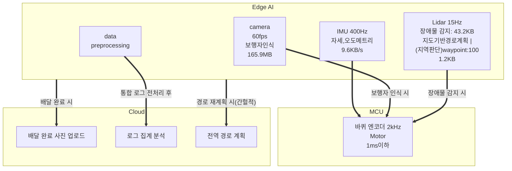

# 모듈 1
## 문제 1
### **1.1. 연산 분담 배치표**

| 모듈 | 연산 | 지연 예산 | 데이터 전송량 | 이유 |
| --- | --- | --- | --- | --- |
| **모터** | 임베디드 | 1ms 이하 | 2륜일 때 2,000(2kHz) x 2 x 4B = 16,000B/s => 16KB/s | LTE 왕복시간은 30~100ms로 지연 예산(1ms 이하)의 30~100배를 초과하고, 실시간으로 초고속 제어(2kHz)를 해야 하기 때문에 MCU(모터 드라이버)에서 처리해야 한다. |
| **장애물 감지** | Edge AI | 100ms 이하 | 1초에 15바퀴(15Hz, 주기 약 66.7ms) 도는 2D 라이다 -> 360(1도~360도) x (4B(거리) + 4B(각도)) = 2,880B -> 2,880 x 15 = 43,200B/s => 43.2KB/s | 데이터가 통신이 되려면 LTE를 통해 왕복을 해야 하는데, 데이터가 클라우드로 왕복하는 것만으로도 지연 예산이 초과되므로 Edge AI에서 즉각 처리해야 한다. |
| **보행자 인식** | Edge AI | 100ms 이하 | 60fps(프레임 간격 약 16.7ms), 1280 x 720 x 3(RGB) = 2,764,800B -> 약 2.76MB/frame -> 2.76MB x 60fps = 약 165.9MB/s(약 1.33Gbps) | 원본 영상 대역폭(약 1.33Gbps)이 LTE 모듈 대역폭(100Mbps)을 13배 이상 초과함. 압축하더라도 영상 압축 15ms, LTE 업로드 70ms, 클라우드 추론 40ms, 결과 수신 30ms = 155ms 이상 소요되어 지연 예산을 초과하므로 Edge AI로 실시간 처리해야 한다. |
| **지도 기반 경로 계획** | 클라우드(전역 판단) + Edge AI(지역 판단) | 전역 판단: 수 초 ~ 수 분<br>지역 판단: 200~500ms | **전역 판단**: 로봇 이동 좌표 X(4B) + Y(4B) + target_angle(4B) = 12B, 웨이포인트 100개 기준 1,200B = 1.2KB, 패킷 오버헤드 포함 수 KB 수준<br>**지역 판단**: 2D 라이다(15Hz): 43.2KB/s, 엔코더(2kHz): 16KB/s, IMU(400Hz): 9.6KB/s(3축 가속도+3축 각속도 24B x 400)<br>=> 센서 총합: 약 68.8KB/s | **전역 판단**: 고정밀 지도 데이터는 수 GB에 달해 서버에 상주시키며, 경로 재탐색 시에만 간헐적으로 요청하므로 LTE 100Mbps 통신망으로도 충분히 여유롭게 처리 가능함.<br>**지역 판단**: 라이다 수집 주기(약 66.7ms) 및 센서 융합(68.8KB/s) 기반 회피 연산(50~150ms)을 Edge AI에서 수행해야 지연 예산(200~500ms) 내에 안전한 회피가 가능함. |
| **배달 완료 사진 업로드** | 클라우드 | 수 초 ~ 수 분 | JPEG: 약 2MB x 배달 건당 1회 | 실시간성이 필요 없고 일시적 음영지역 발생 시 재전송하면 되며, 2MB 용량은 LTE 100Mbps 환경에서 이론상 약 0.16초(실제 환경 수 초 이내)면 전송 가능하므로 클라우드 처리가 적합함. |
| **운행 로그 집계** | 클라우드(최종 집계, 분석) + Edge AI(데이터 필터링 및 요약) | 수 분 ~ 수 시간 | 수십 MB ~ 수 GB | 엔코더(2kHz), IMU(400Hz), 라이다(15Hz) 등의 방대한 로우 데이터를 LTE로 상시 스트리밍하면 통신망 점유 및 비용 문제가 심각함. 따라서 Edge 보드 로컬 스토리지에 버퍼링 및 압축 전처리를 거친 뒤, Wi-Fi 환경이나 통신 여유 시 클라우드로 일괄 전송함. |

---
<br>

### **1.2. 카메라 원시 영상 전송량**
60fps -> 약 16.7ms, 1280 x 720 x 3 = 2,764,800B = 약 2.76MB
초당 전송량: 2.765 x 60 = 약 165.9MB/s -> 165,888,000B/s x 8bit = 약 1327.1Mbps -> 약 1.33Gbps
<br>
**LTE 대비 판단**
LTE 업링크 Cat.4: 50Mbps, 실측 5~20Mbps
업링크 이론 최대(50Mbps)의 약 26.5배, 실측의 약 66~265배
| LTE 업링크 | 대역폭 | 원시 영상 대비 |
| --- | --- | --- |
| LTE 업링크 이론 최대(Cat.4) | 50Mbps | 약 26.5배 부족 |
| LTE 업링크 상한 | 20Mbps | 약 66.4배 부족 |
| LTE 업링크 보통 | 10Mbps | 약 132.7배 부족 |
| LTE 업링크 하한 | 5Mbps | 약 265.4배 부족 |

---
<br>

### **1.3. 인지·판단·제어 계층 매핑과 주기표**
<br>

<계층매핑>
| 계층 | 작업 | 갱신 주기 | 입력 -> 출력 |
| --- | --- | --- | --- |
| 제어 | 모터 제어 | 1kHz ~ 2kHz(0.5~1ms) | **[입력]**: 제어 명령(cmd_vel), 바퀴 엔코더(2kHz), IMU(400Hz)<br>**[출력]**: 모터 드라이버 PWM / 전류 제어 신호 |
| 인지 | 장애물 감지 | 15Hz(약 66.7ms) | **[입력]**: 2D 라이다 포인트 클라우드 데이터(15Hz)<br>**[출력]**: 주변 2D 장애물 지도(Costmap), 극좌표/직교좌표 |
| 인지 | 보행자 인식 | 60Hz(약 16.7ms) | **[입력]**: 720p 원본 RGB 이미지 프레임(60fps)<br>**[출력]**: 보행자 인식 바운딩 박스(Bounding Box) 좌표, 클래스, 신뢰도 |
| 판단 | 지도 기반 경로 계획 | 전역: 간헐적(필요 시)<br>지역: 2~5Hz(200~500ms) | **[입력]**: 전역 고정밀 지도, 목적지, 로봇 현재 위치(SLAM/Odometry), 2D 장애물 지도<br>**[출력]**: 전역 웨이포인트 경로 및 실시간 국소 회피 제어 명령(cmd_vel) |
| 비실시간 | 배달 완료 사진 업로드 | 간헐적(배달 완료 시 1회) | **[입력]**: 720p 카메라 캡처 후 압축된 JPEG 이미지(약 2MB)<br>**[출력]**: 클라우드 전송 완료 HTTP/gRPC 응답(성공 플래그) |
| 비실시간 | 운행 로그 집계 | 일괄(수 시간 ~ 1일 주기) | **[입력]**: 엔코더·IMU·라이다 전처리/압축 로그 파일(Edge 로컬 스토리지 버퍼링)<br>**[출력]**: 클라우드 DB 적재 및 모니터링/예측 유지보수 대시보드 시각화 |

<br>

<멀티레이트 데이터 흐름>



<br>

### **1.4. Hard / Firm / Soft분류표**
<br>

| 작업 | 등급 | 이유 |
| --- | --- | --- |
|모터 제어|Hard|데드라인을 놓치면 로봇 움직임 제어가 안되기 때문|
|비상 정지(보행자 인식)|Hard|보행자를 인식했을때 비상 정지를 즉각 실시하지 않으면 충돌이 일어날 수 있기 때문에 데드라인을 놓치면 안됨|
|장애물 회피|Hard|비상 정지와 마찬가지로 장애물 회피도 즉각 실시하지 않으면 충돌이 일어날수 있어서 데드라인을 놓치면 안됨.|
|카메라 프레임 기반 객체 인식|Firm|카메라 프레임은 현재의 이미지만 중요하기 때문에 미처 처리하지 못한 결과는 폐기해도 됨|
|Lidar인식|Firm|로봇과 보행자는 계속 움직이고 있기 때문에 100ms전에 들어온 데이터는 시간이 지나면 과거의 위치가 되어 가치가 없어지기 때문에 폐기해도됨|
|장애물 우회 경로 재계획|Firm|빠르게 움직이는 보행자가 갑자기 인식되어서 피하려고 했는데 이미 지나가서 장애물이 아니게 되면 회피할 필요가 없으므로 그 데이터는 삭제해도 됨|
|지도 갱신, 경로 재계획(전역판단)|Soft|응답이 늦어도 원래 경로로 계속 진행하거나 잠시 대기해도됨. 응답이 늦을수록 배달시간은 길어지지만 경로는 여전히 사용 가능|
|로그 업로드, 모니터링|Soft|로그 업로드 느려도 로봇과 상관없음|

<br>

### **1.5. 주기 <sup>.</sup> 지연<sup>.</sup> 지터 구분**
- **주기(period)**: 작업이 **얼마나 자주** 반복되는가. -> 0.5ms마다 모터 제어 => 바퀴 엔코더 주기 0.5ms(2kHz), 라이다 주기 약 66.7ms(15Hz), 카메라 프레임 주기 약 16.7ms(60fps)
- **지연(latency)**: 입력이 들어와서 출력이 나올 때까지 **걸리는 시간**. -> 클라우드로 업로드하는 시간 70ms + 추론 40ms + 다운로드(결과 수신) 시간 30ms = 약 140ms가 지연
- **지터(jitter)**: 주기의 들쭉날쭉한 정도. -> Edge 컴퓨터가 다른 작업을 처리하느라 지연이 10~30ms 편차를 보인다고 하면, 라이다가 스캔하는 데 약 66.7ms, 스캔 후 판정 후 명령까지 걸리는 기본 처리 시간이 지연, 그 지연 시간의 흔들림 폭(±10~30ms)이 지터이다.

## 문제 2

### **2.1. 고른 접속 대상**
- localhost로 접속
---
- 무비밀번호 접속 로그

```
Aug 25 12:27:55 pa29-Legion-Pro-5-16IAX10 sshd[22450]: Accepted publickey for pa29 from 127.0.0.1 port 59906 ssh2: RSA SHA256:7LmJA7u/eFqdoSyBnUeh0Htiir1iiwb1cvqbdTL+xbc
```
- who, echo $SSH_CONNECTION
```
pa29@pa29-Legion-Pro-5-16IAX10:~$ who
pa29     :0           2026-08-25 10:18 (:0)
pa29     pts/4        2026-08-25 12:27 (127.0.0.1)
pa29@pa29-Legion-Pro-5-16IAX10:~$ echo $SSH_CONNECTION
127.0.0.1 59906 127.0.0.1 22
```
---
### **2.2. 개인키, 공개키 중 서버에 등록하는 것**
- 공개키
    - 서버에 접속 허용할 사용자의 공개키를 등록하고 사용자가 접속을 시도하면 서버는 공개키를 이용해 문제를 내고 클라이언트는 자신이 가진 개인키로 이걸 풀어내서 증명해야 한다. 만약 개인키를 등록하고 공개키로 접속 허용이 된다고 하면 공개키는 누구나 받을 수 있는거라서 아무나 접속 허용이 되어 보안에 매우 취약해진다. 따라서 공개키를 서버에 올리는 것이 안전하다.
    
### **2.3. 원격 단일 명령 실행과 scp 전송 출력**

<원격 단일 명령>
```
pa29@pa29-Legion-Pro-5-16IAX10:~$ ssh pa29@localhost 'uname -a'
pa29@localhost's password: 
Linux pa29-Legion-Pro-5-16IAX10 6.8.0-138-generic #138~22.04.1-Ubuntu SMP PREEMPT_DYNAMIC Fri Aug  7 13:43:15 UTC  x86_64 x86_64 x86_64 GNU/Linux
```

<scp 전송>
```
pa29@pa29-Legion-Pro-5-16IAX10:~$ scp hi.txt pa29@localhost:/home/pa29/scpTest
pa29@localhost's password: 
hi.txt                                        100%   41    53.3KB/s   00:00 
```

### **2.4. 두 장치를 구분한 속성**
- 라이다: /dev/loop20
- IMU: /dev/loop19

### **2.5. 작성한 udev 규칙 2개 + 규칙 키 설명표**
<udev 규칙>
```
#Lidar
SUBSYSTEM=="block", KERNEL=="loop*",ATTR{loop/backing_file}=="*lidar*",SYMLINK+="robot_lidar",MODE="0666"

#IMU
SUBSYSTEM=="block",KERNEL=="loop*",ATTR{loop/backing_file}=="*imu*",SYMLINK+="robot_imu",MODE="0666"

```
<규칙 키 설명표>
|규칙 키|연산자|설정 값|설명|
| --- | --- | --- | --- |
|SUBSYSTEM|==|block|장치가 속한 시스템의 종류가 일치하는지 비교|
|KERNEL|==|loop*|커널이 장치에 부여한 이름이 loop로 시작되는 장치인지 확인|
|ATTR{loop/backing_file}|==|*lidar*,*imu*|장치에 마운트된 세부 속성값이 lidar인지 imu인지 확인|
|SYMLINK|+=|robot_lidar,robot_imu|조건이 맞을 경우 추가할 고정된 심볼릭 링크 이름을 추가, 포트가 바뀌어도 항상 같은 이름으로 센서에 접근할 수 있음|
|MODE|==|0666|접근권한을 할당. 0666은 시스템의 모든 사용자가 장치 읽고 쓸 수 있도록 허용한다는 의미|

<br>

### **2.6. 순서를 바꿔 재연결한 뒤 ls -l /dev/robot_\*  결과**
```
pa29@pa29-Legion-Pro-5-16IAX10:~/fake_sensors$ sudo losetup -f --show imu.img 
/dev/loop17
pa29@pa29-Legion-Pro-5-16IAX10:~/fake_sensors$ sudo losetup -f --show lidar.img /dev/loop18
pa29@pa29-Legion-Pro-5-16IAX10:~/fake_sensors$ ls -l /dev/robot_*
lrwxrwxrwx 1 root root 6 Aug 25 16:04 /dev/robot_imu -> loop17
lrwxrwxrwx 1 root root 6 Aug 25 16:04 /dev/robot_lidar -> loop18

```

### **2.7. 실제 USB 센서용 규칙 초안과 구분 근거**
<실제 USB 센서용 규칙 초안>
```
# Motor Driver - serial 값은 본인 장치에 맞게 변경
SUBSYSTEM=="tty", ATTRS{idVendor}=="10c4", ATTRS{idProduct}=="ea60", ATTRS{serial}=="YOUR_SERIAL", SYMLINK+="motor_driver", MODE="0666"

# AHRS IMU
SUBSYSTEM=="tty", ATTRS{idVendor}=="YOUR_VID", ATTRS{idProduct}=="YOUR_PID", SYMLINK+="imu", MODE="0666"

# Front LiDAR
SUBSYSTEM=="tty", ATTRS{idVendor}=="10c4", ATTRS{idProduct}=="ea60", ATTRS{serial}=="YOUR_SERIAL", SYMLINK+="rplidar_front", MODE="0666"

# Back LiDAR
SUBSYSTEM=="tty", ATTRS{idVendor}=="10c4", ATTRS{idProduct}=="ea60", ATTRS{serial}=="YOUR_SERIAL", SYMLINK+="rplidar_back", MODE="0666"
```
<구분 근거>
- 제조사 및 제품 ID: ATTRS{idVendor}, ATTRS{idProduct}
- serial 넘버: ATTRS{serial}

## 문제 3
### **3.1. 저장소 URL/PR URL**
- 저장소 URL: https://github.com/SpartaPA/physicalai-lv1-gyujinsim
- PR URL: https://github.com/SpartaPA/physicalai-lv1-gyujinsim/pull/1

### **3.2. PR 리뷰 코멘트와 반영 커밋
PR 링크: https://github.com/SpartaPA/physicalai-lv1-gyujinsim/pull/1

### **3.3. 충돌이 난 파일과 줄**
- <<<<<<<: 현재 브랜치
- =======: 그냥 구분선
- \>>>>>>>: 현재 브랜치와 충돌이 난 파일이 어느 브랜치에서 왔는지
- 해결방법: Accept current change, Accept incoming change, Accept both changes가 있는데 각각 <<<<<<<쪽에 있던 내용만 남기고 싹 지워버리기, >>>>>>> 쪽에 있었던 내용만 남기기, 두 내용을 모두 살리고 충돌 마커 기호들만 싹 지우고 충돌 해결

### **3.4. merge 방식 이력 그래프/ rebase 방식 이력 그래프**

```
<merge>,<rebase>
* 66f9b6f (HEAD -> branch-rebase) rebase test
* 96f8d11 (main) rebase test commit
*   19f5b7e branch-merge test
|\  
| * c717885 (branch-merge) merge test
* | 8efef0f main test
|/  
* 69e11b8 initial commit
* 4bd58f3 (origin/main, origin/HEAD) Initial commit
```


merge는 메인 브랜치에서 뻗어나온 branch-a 와 branch-b를 병합해서 새로운 merge된 브랜치를 만든다. 하지만 rebase는 rebase를 하려는 브랜치로 시작점을 옮겨준다.

### **3.5 언제 merge를, 언제 rebase를 쓸지**
merge는 팀과 함께 보는 공용 브랜치에서 사용, rebase는 나혼자 사용하는 로컬 브랜치에서 사용

